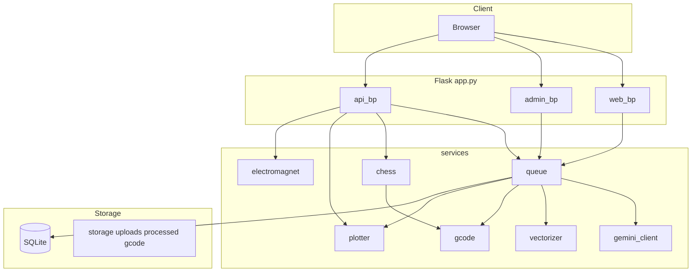

# CLAUDE.md

Guidance for working in this repository. The application is **Flask** ([`app.py`](app.py): `create_app()`, blueprints for web, admin, and API).

## Build and run

**Recommended (no shell activation; Raspberry Pi / root-friendly):** from repo root:

```bash
make setup-prod   # or make setup for dev deps (ruff, pytest)
export FLASK_APP=app.py
"$(pwd)/.venv/bin/flask" run --host=0.0.0.0 --port=5000
```

**Classic venv activate:**

```bash
python -m venv .venv
source .venv/bin/activate
pip install -r requirements.txt

# Neo_Chess: dev server proxies /api → Flask :5000
cd Neo_Chess && npm ci && npm run dev

# In another terminal:
export FLASK_APP=app.py
flask run
```

Production/static build: `cd Neo_Chess && npm run build` and serve `Neo_Chess/dist` under base path `/chess/` (see [`Neo_Chess/vite.config.ts`](Neo_Chess/vite.config.ts)).

## Testing and linting

Uses `.venv/bin/python` automatically; run `make setup` first (installs `requirements-dev.txt`).

```bash
make fmt     # ruff format + ruff check --fix
make lint    # ruff check + ruff format --check
make test    # pytest via .venv
```

Tests use mocks and in-memory SQLite; no serial or Pi GPIO required.

## Environment

Copy [`env.example`](env.example) to `.env`. See [`README.md`](README.md) for caricature, plotter, chess geometry, and **Raspberry Pi GPIO electromagnet** variables (`ELECTROMAGNET_*`).

## Architecture



### Request flows (high level)

- **Caricature:** `/` → upload → Gemini → vectorize → admin approve → print over serial.
- **Chess API:** `/api/chess/move` (verbose chess.js payload), `/api/chess/execute-move` (UCI or `from`/`to`), board preview/print/demo routes in [`blueprints/api.py`](blueprints/api.py).
- **Plotter:** [`services/plotter.py`](services/plotter.py) streams G-code; host-only `; @MAGNET_ON` / `; @MAGNET_OFF` lines toggle [`services/electromagnet.py`](services/electromagnet.py) when an instance is passed in.

### Key modules

- [`config.py`](config.py): class-based `Config` from environment.
- [`blueprints/web.py`](blueprints/web.py), [`blueprints/admin.py`](blueprints/admin.py), [`blueprints/api.py`](blueprints/api.py): HTTP surface.
- [`services/queue.py`](services/queue.py): job lifecycle, vectorization, print orchestration.
- [`services/chess.py`](services/chess.py): board vectors, move G-code, UCI helpers for execute-move.
- [`services/plotter.py`](services/plotter.py): serial + ACK; magnet directives.

### Job status flow

`submitted` → `generating` → `generated` → `confirmed` → `approved` → `queued` → `printing` → `completed` (or `failed` / `cancelled`).

SQLite: `storage/app.db`. Directories: `storage/uploads`, `storage/processed`, `storage/gcode`.
