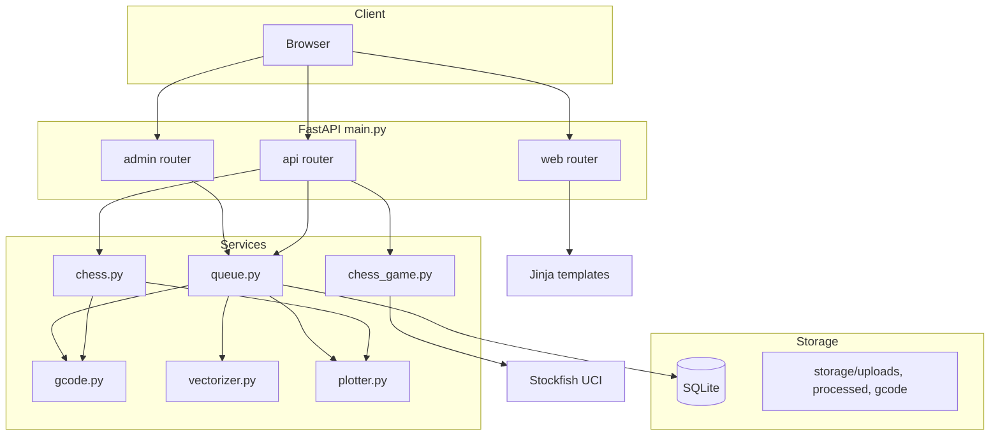

# CLAUDE.md

Guidance for working with this repository (chess_gtm branch: chess only, no caricature/Gemini). App is **FastAPI** (not Flask).

## Build and Run

```bash
python -m venv .venv
source .venv/bin/activate
pip install -r requirements.txt

# Build Neo_Chess front-end (required for /chess)
cd Neo_Chess && npm install && npx vite build && cd ..

uvicorn main:app --reload
```

## Testing and linting

From `ai_plotter` with `.venv` activated:

```bash
pytest
make test
pytest tests/test_queue.py -v
make lint   # ruff check + format check
make fmt    # ruff format + ruff check --fix
```

Install dev deps for lint: `pip install -r requirements-dev.txt`. Tests need no hardware or `PLOTTER_DRY_RUN`.

## Environment

Copy `env.example` to `.env`. Required:
- `PLOTTER_SERIAL_PORT` – serial port for XY plotter (e.g. `/dev/ttyUSB0`, `COM3`)

Optional: `PLOTTER_DRY_RUN=true` to skip serial and write G-code to `.dryrun.txt`.

Chess play is fully offline. Set `STOCKFISH_PATH` if the engine is not on `PATH` (for `/chess-legacy` only).

## Chess robot: physical assumptions

- **Pieces:** Same height assumed (lifted piece clears board); no per-piece or per-type logic. Mixed heights risk collision—recommend uniform piece height or manual clearance check.
- **Clearance:** No Z/lift in chess G-code; magnet at one height. Tall pieces may collide if they differ in height.
- **Board and origin:** Physical board must match `CHESS_BOARD_SIZE_MM`, `CHESS_SQUARE_COUNT`, and origin; optionally `CHESS_DIMENSIONS_JSON` if used.
- **Discard:** Capture discard at `origin - 1.5 * square_size`; ensure off-board and path clear.
- **Magnet timing:** Magnet on for whole move; longest move time ≈ distance / rapid rate. Optional `CHESS_MAGNET_MAX_ON_S` and `CHESS_RAPID_FEED_MM_S` for max-on-time check/warning.

## Architecture



### Request flows

**Chess (Neo_Chess at /chess/)**

- SPA served from `Neo_Chess/dist/public` via `SPAStaticFiles`.
- Moves: `POST /api/chess/execute-move` with `{ uci, capture }` → `move_to_gcode` → `PlotterController.send_gcode_lines` (or dry-run).

**Chess (Legacy at /chess-legacy)**

- Template `chess.html` + Stockfish backend.
- `POST /api/chess/play/setup` – init session.
- `POST /api/chess/play/move` – apply move, optionally `execute` to plotter.
- `POST /api/chess/print` – print board pattern.
- `POST /api/chess/demo/run` – square traversal demo.

**Job queue (Admin)**

- Upload → `create_job_from_manual_upload` → vectorize → store.
- Approve → `queue_for_printing` → `vector_data_to_gcode` → `start_print_job` → `PlotterController.send_gcode_lines`.

### Key modules

- **config.py**: Env-based config (dotenv loaded in main).
- **dependencies.py**: `get_config`, admin cookie auth (`require_admin`, `require_admin_api`).
- **queue.py**: Job lifecycle, vectorization, G-code generation, print orchestration.
- **chess.py**: UCI→G-code for electromagnet moves; board SVG.
- **plotter.py**: USB serial, `send_gcode_lines`, ACK handling.

### Chess UIs

- `/chess` – Neo_Chess (React SPA, in-browser AI via chess.js, localStorage for history). Built from `Neo_Chess/` with `npx vite build`.
- `/chess-legacy` – Legacy template (templates/chess.html) with Stockfish backend via `/api/chess/play/*`.

### Job flow

manual upload → `generated` → `confirmed` → `approved` → `queued` → `printing` → `completed` (or `failed`/`cancelled`).

SQLite: `storage/app.db`. Storage under `storage/`: `uploads/`, `processed/`, `gcode/`.

## Known issues

- **Front-end vertical scroller on `/chess-legacy` is broken**: the legacy chess page should show a vertical scrollbar when content exceeds the viewport; multiple layout/CSS fixes have been tried but the scrollbar still does not appear in some environments.
